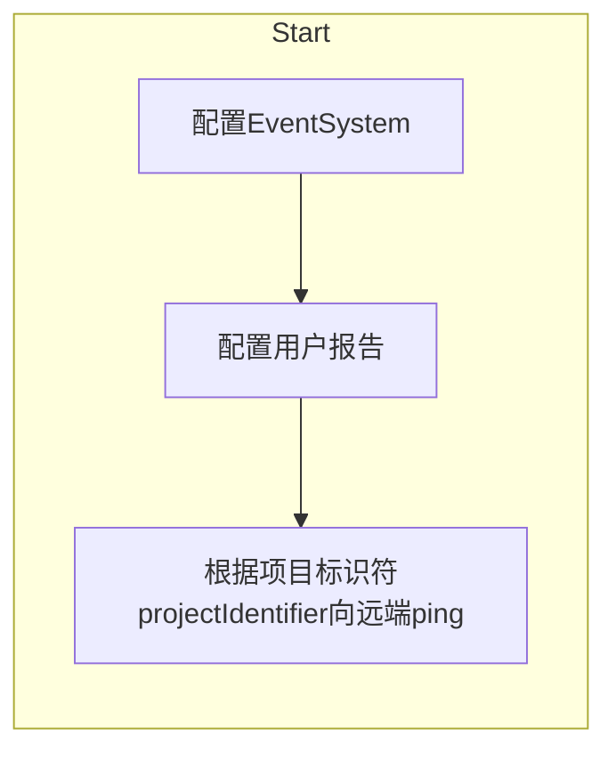
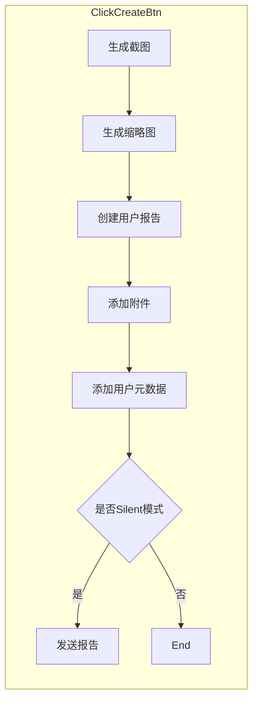
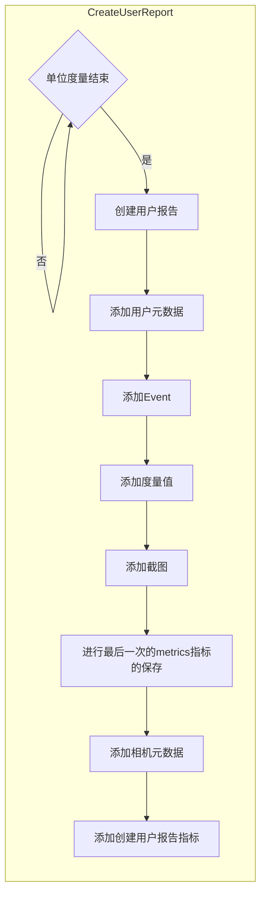
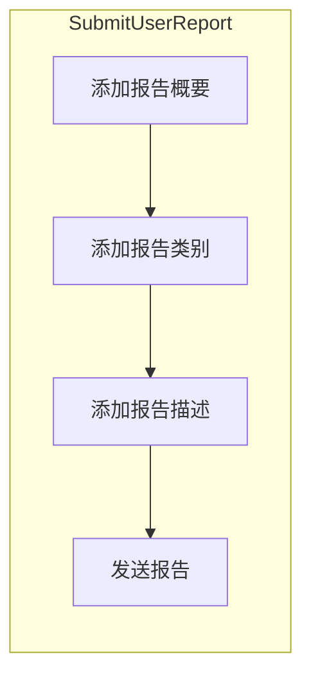

# Unity Cloud Diagnostics
### Cloud Diagnostics有哪些功能？
- 崩溃和异常报告（Crashes and Exceptions）
- 用户报告（User Reporting）

### 在启用Cloud Diagnostics服务之前，需要设置Project for Unity Services
Unity上侧菜单栏选择Windows->Services->选择要关联的组织->点击Create按钮

### 进入Dashboard查看报告详情方式
- Services窗口右上角点击 “Go to Dashboard”
- 登入 https://developer.cloud.unity3d.com/projects/

在收到报告或创建跟踪单等接收通知，可在UserReport窗口右上角添加集成  
有关集成的详细信息[Unity Intergrations](https://docs.unity3d.com/Manual/UnityIntegrations.html)

## 崩溃和异常报告

### 如何启动崩溃和异常报告
1. 打开Services界面
2. 在Services界面中选择Cloud Diagnostics
3. 在“Capture exceptions...”上打勾并填入需要捕获的日志消息数

### 崩溃和异常报告捕获的类型
- 本机崩溃（Native crashes）- 在应用停止响应时捕获堆栈跟踪和其他元数据
- 未处理异常（Unhandled exceptions）- 在应用因未处理异常而停止响应时捕获堆栈跟踪和其他元数据

### 使用CrashReportHandler类配置崩溃报告（需要Unity 2018.3版本及以上）

UnityEngine.CrashReportHandler

#### CrashReRortHandler属性
- `enableCaptureExceptions - bool型，决定是否捕获异常，默认为true`
- `logBufferSize - uint型，保存日志消息的数量，默认为10，范围为0-50`
#### CrashReRortHandler方法
- `public static string GetUserMetadata(string key) - 返回已设置好的自定义元数据`
- `public static string SetUserMetadata(string key, string value) - 设置自定义元数据且加入到崩溃报告中`  

[API](https://docs.unity3d.com/2018.3/Documentation/ScriptReference/CrashReportHandler.CrashReportHandler.html)

## 用户报告

### 如何启动用户报告
1. 打开项目
2. 下载SDK并解压
3. 在Project的Asset目录中添加UserReporting目录
4. 将解压出来的UserReporting放入
5. 双击导入
6. 在项目场景中，将Asset/UserReporting/Prefabs文件夹下的UserReportingPrefab拖入

### 使用用户报告的好处
- 捕获游戏中的错误报告或玩家的一般反馈
- 包括自定义字段，例如标题，摘要和附件
- 分析设备元数据，事件，指标和屏幕截图
- 通过以维度的形式添加过滤器来搜索报告
- 通过立即获取所需的所有信息，消除您与玩家的来回
- 通过集成到达新报告时立即收到通知

### 配置用户报告
- FramesPerMeasure - 设置单位度量中有多少帧，默认为60帧，即一度量60帧，度量决定Metrics图的横坐标（间隔）
- MaximumMeasureCount - 最大度量数量，默认为300，决定Metrics图的横坐标范围
- MaximumEventCount - 最大事件数量，默认为100
- MaximumScreenshotCount - 最大截图数量，默认为10

### Metrics指标折线图
- Metrics折线图中每一横坐标有三个点，从上到下依次为**最大值**、**平均值**、**最小值**

### 组件结构
```shell
├── Prefabs
│	└── UserReportingPrefab.prefab	//预设好的用户报告组件
├── Scripts
│	├── Client	
│	│	├── UserReporting.cs		//用户报告类
│	│	├── UserReportingClient.cs	//负责用户数据的收集与保存
│	│	├── UserReportingClientConfiguration.cs  //用户报告的配置
│	│	└── ...  数据结构类文件
│	└── Plugin    
│		├── UnityUserReportingPlatform.cs    //负责对Metrics图采样和MetaData元数据的收集
│		├── UnityUserReporting.cs    //UserReport的Configure方法
│		└── ...  //工具
├── FramerateMonitor.cs    //定义了监测到程序出现帧率问题就自动发送用户报告的行为     
├── UserReportingScript.cs	//入口脚本，负责创建用户报告和发送用户报告
├── UserReportingConfigureOnly.cs    //定义了只进行用户报告的配置且不添加附加功能的行为
├── UserReportingMonitor.cs    //定义了监测程序出现问题就自动发送用户报告的行为 
└── ...    //平台类型、状态的定义等文件
```

### 程序流程
- 总体概况
```mermaid
    graph LR
    app_start[程序启动]
    on_start[调用start]
    click_btn[创建用户报告]
    input_text[输入报告内容]
    submit_report[发出报告]
    cancel_report[取消报告]

    subgraph 
    app_start--激活Prefab--> on_start
    on_start--点击创建报告按钮--> click_btn
    click_btn--> input_text
    input_text--> submit_report
    input_text--> cancel_report
    end
```
---
- 调用Start()
  - 配置用户报告 - 调用Plugin/UserReporting.cs中的configure方法，**第三个参数配置了Metrics采样指标**，用户报告参数详情可见Client/UserReportingConfiguration.cs，具体采样指标可见Plugin/UserReportPlatform的GetSamplerNames方法

---
- 创建用户报告
  - 生成截图及缩略图会对性能产生明显影响，通过更改截图参数来降低性能消耗
    - 使用屏幕截图时，可以指定一个对以下情况有用的回调：
      - 在显示屏幕截图之前动画加载栏
      - 显示允许用户在进入用户报告的下一阶段之前标记屏幕截图的屏幕
    - 生成截图时会在日志上生成相应记录，图片采用**Base64**的格式存储
  - 创建用户报告 - **调用Client/UserReportingClient.cs中的CreateUserReport方法**
  - 官方代码添加的附件是一个**Sample**，没有用的，需要替换
  - 这里用户元数据为**设备平台信息**和**游戏版本信息**
  - Silent模式即点击了创建报告按钮后直接发送报告，玩家不用输入报告说明

---
- Client/UserReportingClient.cs中的CreateUserReport()
  - 报告不能包含部分度量,报告都是单位度量结束后生成
  - UserReport实例实际是现在生成的，然后从UserReportingClient中取数据存入report当中
  - metrics即衡量指标，metrics图可以用来展示用户运行程序时的**FPS、电池、内存**等变化折线图，最后一次metrics的保存后会对结果进行排序

---
- 发出报告
  - 发送报告会对进度条进行装饰，详见Client/UserReportingClient.cs中的SendUserReport方法

---
### 主要方法
- 添加设备元数据  
` UnityUserReporting.CurrentClient.AddDeviceMetadata(string name, string value) `  
添加设备元数据对性能的影响可以忽略不计

- 记录事件  
` UnityUserReporting.CurrentClient.LogEvent(UserReportEventLevel level, string message) `  
记录事件对性能的影响可以忽略不计，Debug的log方法也能记录事件  
预设Prefab是通过在UserReportingClient的Update()调用UserReportingPlatform的Update()进行日志的更新

- 添加抽样指标  
` UnityUserReporting.CurrentClient.SampleMetric(string name, double value) `  
添加采样指标对性能的影响可以忽略不计，但是若是每帧都调用它，则定义的每个不同名称都会为大量的报告大小
预设Prefab是通过在UserReportingClient的Update()调用UserReportingPlatform的Update()进行指标的更新

- 添加屏幕截图  
` UnityUserReporting.CurrentClient.TakeScreenshot(int maximumWidth, int maximumHeight, Action callback) `  
截取屏幕截图会对性能产生明显影响，且userreport大小不能超过10MB

- 从多个摄像机角度或多个来源截取屏幕截图
` UnityUserReporting.CurrentClient.TakeScreenshotFromSource(int maximumWidth, int maximumHeight, object source, Action callback) `  
  - 如果源是`null`，屏幕截图就是屏幕  
  - 如果源是`Camera`，则将相机渲染作为屏幕截图  
  - 如果源是`RenderTexture`，则渲染纹理作为屏幕截图

- 添加附件  
附件编码为Base64对象

- 直接使用客户端  
如果创建自定义报告，则用户报告会提供`UnityUserReportingUpdater`类，例如：
```
private void Update()
{
    this.UnityUserReportingUpdater.Reset();
    this.StartCoroutine(this.UnityUserReportingUpdater);
}
```
如果需要比`UnityUserReportingUpdater`提供更多的粒度，则可以通过调用`UnityUserReporting.CurrentClient.Update()`方法每帧更新报告客户端，然后通过调用`UnityUserReporting.CurrentClient.UpdateOnEndOfFrame()`在每个帧的末尾更新报告客户端  
- 创建报告  
`UnityUserReporting.CurrentClient.CreateUserReport(Action callback)`  
- 发送报告
`UnityUserReporting.CurrentClient.SendUserReport(UserReport UserReport, Action callback)`  
- 亦或者创建一个新的客户端  
`new UserReportingClient(string endpoint, string projectIdentifier, IUserReportingPlatform platform, UserReportingClientConfiguration configuration)`  
每个客户端都维护单独的事件，指标，屏幕截图等

- 增加报告维度  
`report.Dimensions.Add(new UserReportNamedValue("Platform", "Windows"));`

[API](https://unitytech.github.io/clouddiagnostics/api/Unity.Cloud.UserReporting.Client.html)
## 参考资料

- https://unitytech.github.io/clouddiagnostics/crashesandexceptions/UnityCloudDiagnosticsUnderstandingReports.html
- https://unitytech.github.io/clouddiagnostics/userreporting/UnityCloudDiagnosticsUserReports.html